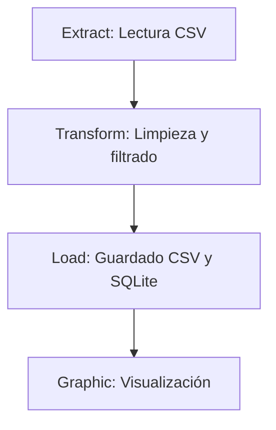
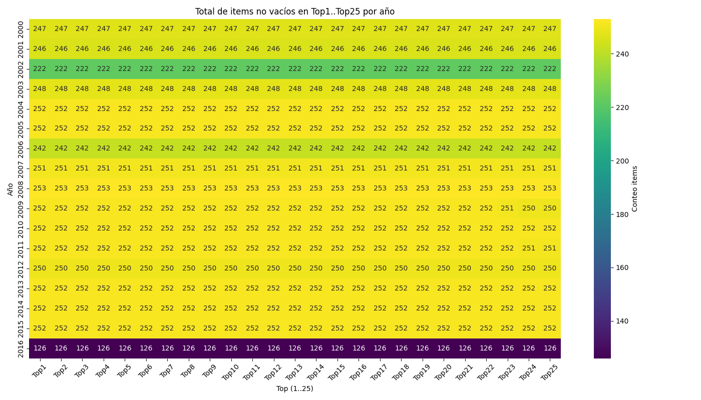
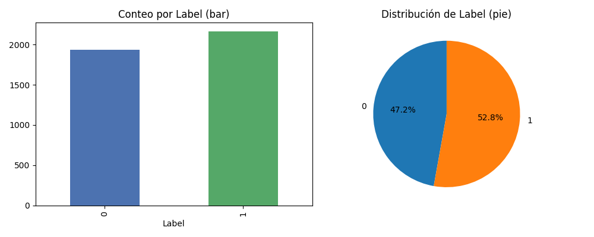
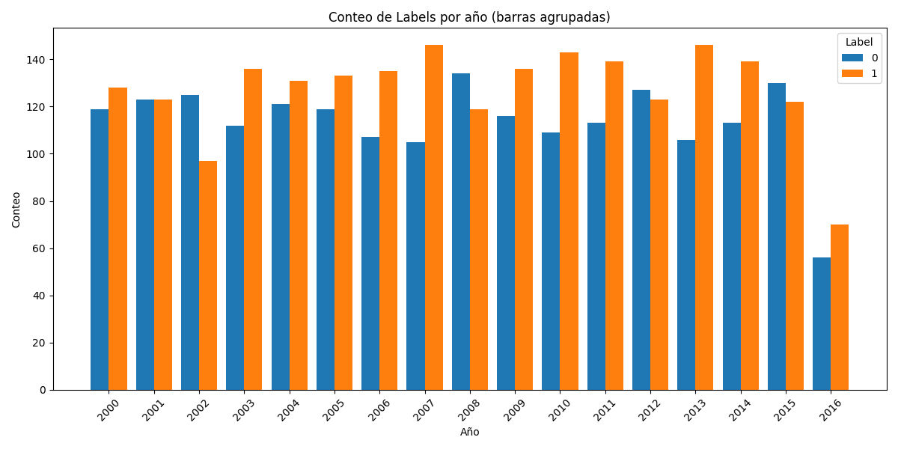
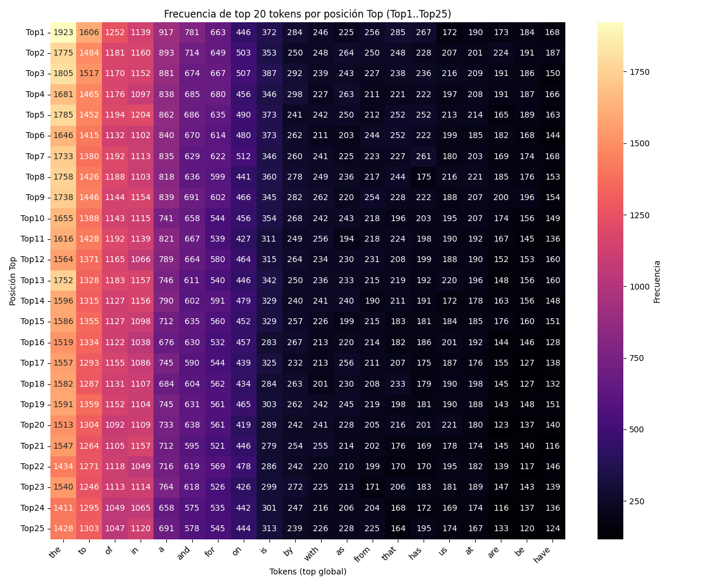
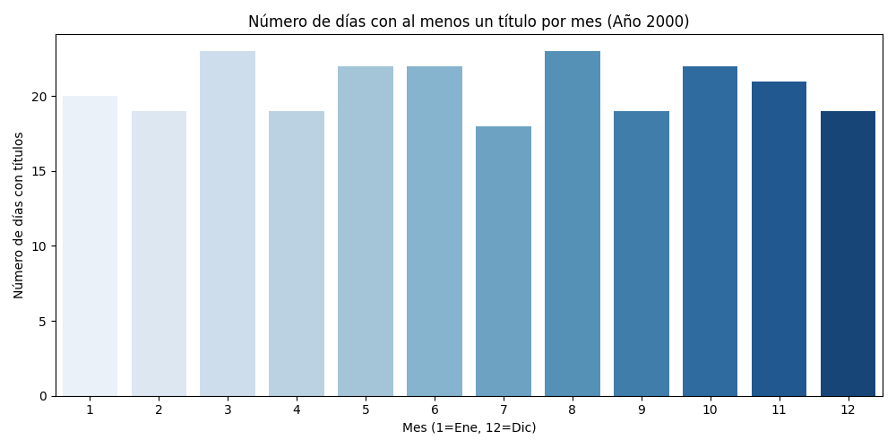

# 📰 LIMPIEZA Y GRÁFICAS BÁSICAS 📰 ETL en Python 🐍

## Descripción del proyecto
Este repositorio contiene un pipeline ETL (Extract, Transform, Load) en Python diseñado para limpiar y analizar un dataset de sentimientos sobre acciones. El pipeline extrae los datos desde CSV, aplica transformaciones y limpieza, guarda un CSV limpio y lo inserta en una base SQLite, y genera gráficas EDA (exploratory data analysis).

## 📁 Estructura del proyecto

```
├── LICENSE
├── main.py                                 # Punto de entrada del pipeline
├── README.md
├── requirements.txt                        # Dependencias del proyecto
├── Config/
│   ├── __init__.py
│   └── LimpiezaConfig.py                   # Configuración (rutas, SQLite)
├── Extract/
│   ├── __init__.py
│   ├── LimpiezaExtract.py                  # Lectura / queries iniciales
│   ├── Files/
│   │   ├── output_clean.csv                # CSV limpio (generado)
│   │   └── stock_senti_analysis.csv        # CSV origen
│   └── Graphic/
│       └── LimpiezaGraphic.py              # Generación de gráficas EDA
├── Transform/
│   ├── __init__.py
│   └── LimpiezaTransform.py                # Funciones de limpieza/transformación
├── Load/
│   ├── __init__.py
│   └── LimpiezaLoader.py                   # Guardado a CSV y SQLite
├── Docs/
    ├── 01_label_time_series.png
    ├── 02_label_distribution.png
    ├── 03_label_by_year_grouped.png
    ├── 04_top_words_by_position.png
    └── 05_titles_per_month_2000.png
```

## ⏳ Diagrama simple del flujo ETL



## 🔗 Dataset

El dataset que se utilizo en este proyecto fue creado por Shubham Trivedi, esta disponible en Kaggle:

**[Sentiment Analysis for Dow Jones (DJIA) Stock](https://www.kaggle.com/code/shubhamptrivedi/sentiment-analysis-for-dow-jones-djia-stock/input)**

## Requisitos

- Python 3.8+ (se recomienda 3.10+)
- Dependencias
- requests
- pandas
- numpy
- seaborn
- matplotlib

## ⤵️ Instalación rápida (Windows PowerShell)

1. Crear y activar un entorno virtual (opcional pero recomendado):

```powershell
python -m venv .venv; .\.venv\Scripts\Activate.ps1
```

2. Instalar dependencias:

```powershell
pip install -r requirements.txt
```

## Ejecución

Desde la raíz del repositorio puedes ejecutar todo el pipeline con:

```powershell
python .\main.py
```

Esto hará lo siguiente:
- Leer `Extract/Files/stock_senti_analysis.csv` (ruta configurada en `Config/LimpiezaConfig.py`).
- Aplicar la limpieza y transformaciones definidas en `Transform/LimpiezaTransform.py`.
- Guardar el dataset limpio en `Extract/Files/output_clean.csv`.
- Guardar los resultados en SQLite en la ruta indicada por `LimpiezaConfig.SQLITE_DB_PATH` (tabla `Limpieza_data`).
- Generar gráficas EDA y guardarlas en `Docs/` (por defecto). Las imágenes generadas incluyen heatmaps, distribuciones y la nueva gráfica "Conteo de Labels por año (barras agrupadas)".

Generar sólo las gráficas (sin correr todo el pipeline):

```powershell
python .\Extract\Graphic\LimpiezaGraphic.py
```

## 🛑 Salida y artefactos 

- CSV limpio: `Extract/Files/output_clean.csv`
- Base de datos SQLite: `Extract/Files/Limpieza.db` (tabla `Limpieza_data`)
- Gráficas: carpeta `Docs/` con archivos PNG (por ejemplo `03_label_by_year_grouped.png`).

## 📊 Gráficas generadas

El pipeline genera varias gráficas EDA y las guarda en la carpeta `Docs/`. A continuación se listan las principales imágenes generadas y una breve explicación de cada una. Si abres el repositorio en un visor (por ejemplo VS Code) verás las miniaturas; también puedes abrir los PNG directamente.

1. 
   - Heatmap: items no vacíos en Top1..Top25 por año
   - Qué muestra: un heatmap con los años en el eje Y (por defecto 2000–2016) y las posiciones Top1..Top25 en el eje X. Cada celda contiene el conteo de items no vacíos observados en esa posición Top para el año.
   - Interpretación: permite ver en qué años y en qué posiciones de Top hubo más información disponible; ayuda a detectar años con poca presencia de artículos o cambios en la cobertura.

2. 
    - Distribución de la variable `Label` (bar + pie)
	- Qué muestra: un gráfico de barras con el conteo absoluto por label y un gráfico de pastel con la proporción relativa.
	- Interpretación: útil para conocer la prevalencia de cada label (por ejemplo: positiva/negativa/neutral) en el dataset completo.

3. 
    - Barras agrupadas: conteo de `Label` por año (nuevo)
	- Qué muestra: por cada año, se muestran barras para cada label indicando el número de registros del dataset con ese label en ese año.
	- Interpretación: permite observar tendencias temporales (años con aumentos de sentimiento positivo/negativo), detectar anomalías o periodos con mayor actividad.

4. 
    - Heatmap de tokens por posición Top
	- Qué muestra: un heatmap donde las filas son posiciones Top (Top1..TopN) y las columnas son tokens (top global). Cada celda indica la frecuencia del token en esa posición.
	- Interpretación: ayuda a identificar palabras que aparecen consistentemente en determinadas posiciones (por ejemplo, si cierto token suele ubicarse en Top1) y puede guiar la creación de features basadas en posición.

5. 
    - Conteo de días con al menos un título por mes (Año 2000)
	- Qué muestra: un gráfico de barras con el número de días por mes (enero..diciembre) que tuvieron al menos un título en el año 2000.
	- Interpretación: específico para el año 2000; útil para análisis temporales y estacionalidad (por ejemplo, meses con mayor cobertura informativa).

## 🗒️ Notas sobre las imágenes

- Si alguna gráfica no aparece, revisa que `Docs/` contenga los PNG; el script `main.py` crea esos archivos tras ejecutar la parte gráfica.
- Para datasets muy grandes o con muchos labels/años, algunas gráficas pueden quedar saturadas: considera filtrar por top-K labels o por un rango de años.

## Explicación del ETL

- Extract: se cargan los datos desde un CSV. La clase `LimpiezaExtract` abstrae esta lectura y puede contener consultas o filtros iniciales.
- Transform: la función `full_clean_stock_sentiment` en `Transform/LimpiezaTransform.py` realiza limpieza completa: parseo de fechas, normalización de texto, manejo de valores nulos, y cualquier transformación específica del dataset (columna `Label`, columnas `Top1..Top25`, etc.).
- Load: `LimpiezaLoader` guarda el DataFrame limpio a CSV y lo exporta a SQLite.
- Graphic: generación de varias gráficas EDA (heatmaps, distribuciones, conteos por año, etc.).

## Brief de resultados

Al ejecutar el pipeline sobre el dataset incluido, se obtienen:
- Un CSV limpio con columnas normalizadas y fechas parseadas (`output_clean.csv`).
- Una base SQLite con la tabla `Limpieza_data` para consultas posteriores.
- Varios PNG en `Docs/` con EDA. Particularmente, la gráfica `03_label_by_year_grouped.png` muestra cómo se distribuyen los labels (por ejemplo: positivo/negativo/neutral) a lo largo de los años. Esto permite observar tendencias históricas en el sentimiento asociado a las acciones.

## Conclusiones y observaciones propias

- Calidad de fecha: La limpieza se asegura de convertir `Date` a tipo datetime; si el dataset tiene fechas mal formateadas, esas filas se filtran o corrigen según las reglas del archivo transform.
- Distribución de labels por año: la gráfica de barras agrupadas facilita identificar años con mayor proporción de un label (por ejemplo, años con más noticias positivas o negativas). Esto es útil para relacionar eventos macroeconómicos o del mercado con el sentimiento observado.
- Tokens y posiciones Top: los heatmaps que analizan desde el Top1 hasta el Top25 y tokens por posición permiten detectar palabras recurrentes y su posición en listas Top, lo que puede ayudar a construir features para modelos de NLP o scoring.
- Limitaciones:
	- Si hay muchos labels o muchos años, la gráfica puede saturarse; conviene filtrar por los labels más frecuentes o agrupar años.
	- La tokenización es básica (split por espacios/comas y limpieza regex). Para análisis más robusto convendría usar tokenizadores de NLP y normalización más completa.